# DESIGN STUFFS

### Aly Fluckey
#### @wtfluckey

This file included the presenter notes, indicated by a ^ at the beginning of the line. To view the presentation as a deck, please go here. 

---

## 1. Plan
at least a little bit 

---

## CONTENT

---

### keep it simple

---

### [why so superfluous?](https://www.icann.org/en/stewardship)


---

### establish hierarchy

^ display all of the different elements in our design effectively 
how important are they?
what level of focus or attention needs to be placed on them?
shopping cart example - better make the path to checkout easy

---

> Hierarchy is also about storytelling; it’s about our user’s journey through the website and the user flow we create
--Rachel Shillcock

^	- how does the content relate to each other?
	how it will be laid out? 
	- make the content as easy to digest as possible
	- not just about content and images
	- headings, lists, quotes, imagery etc
	- break up the content and make it easier to communicate 

---

### some ways to help establish hierarchy

- color
- contrast
- size
- alignment
- repetition
- whitespace

---

create a sitemap 

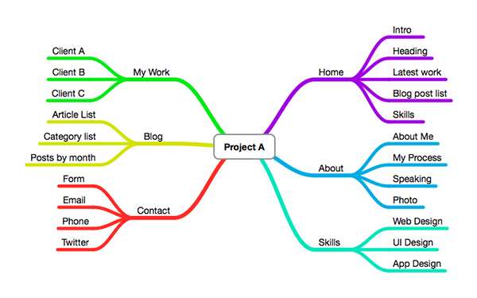

^ talk about sitemap example

---

### set the tone

^ think about the intent of the product
creative and fun? 
modern and sophisticated?
make sure everything portrays the tone and motive
	images
	colors
	fonts
	actual content

--- 

### sketch

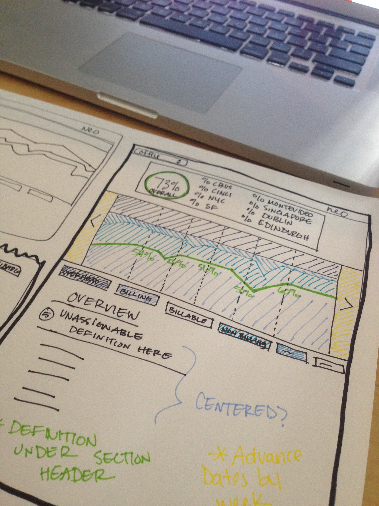

^ 	- brainstorm
    - expiriment
	- take notes
	- have fun

---

### wireframes 

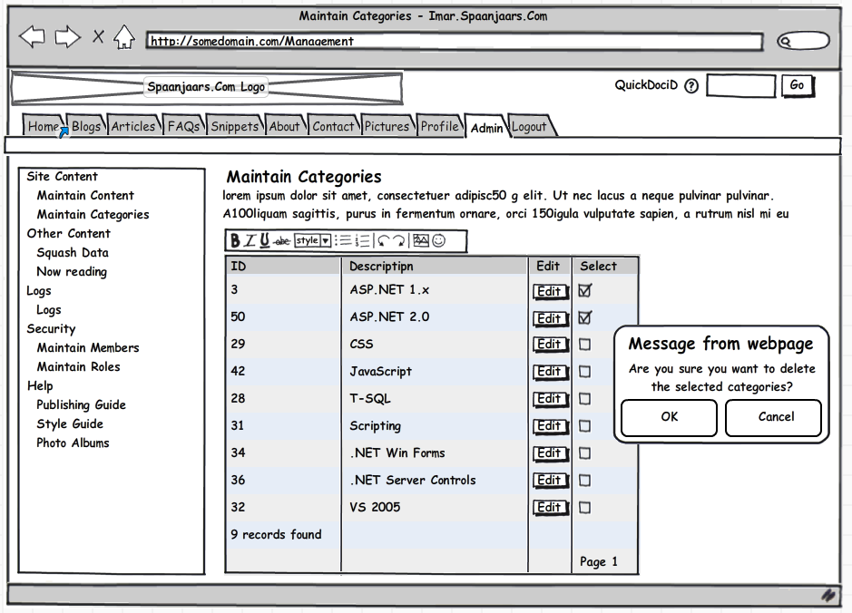

[balsamiq.com](https://balsamiq.com/)

^ think about layout and flow
	both on page level and site level

---

## COLOR

--- 

### the basics 

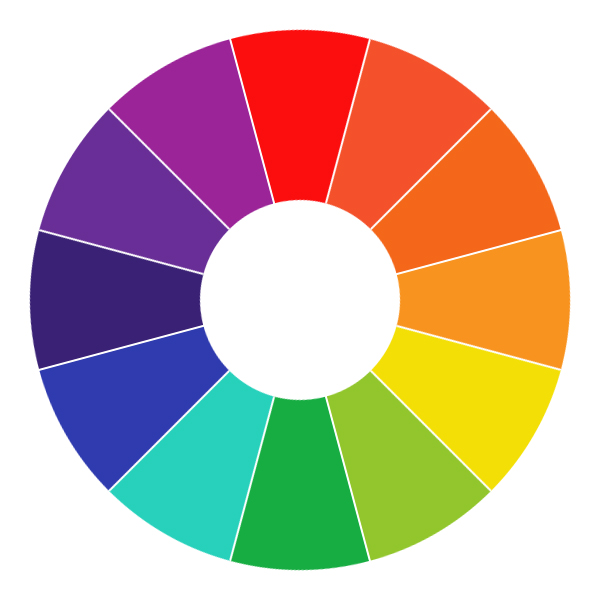

---

primary

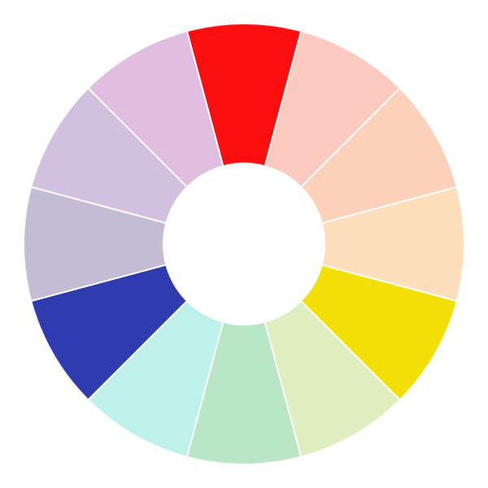

red, blue and yellow, also known as base colors

---

secondary

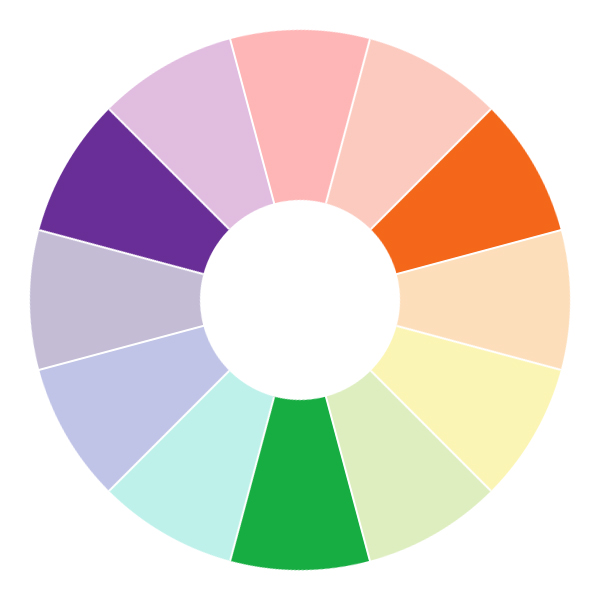

green, purple and orange, made when you mix 2 primary colors together

---

tertiary


created when you mix 1 primary color and 1 secondary color

---

warm family

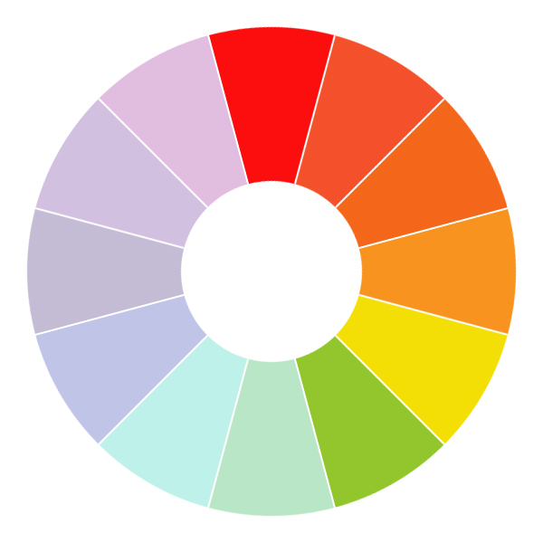

---

cool family

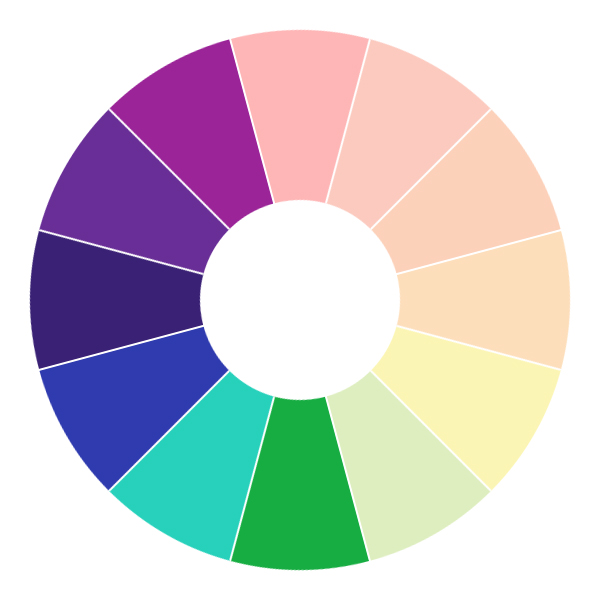

---

### complementary

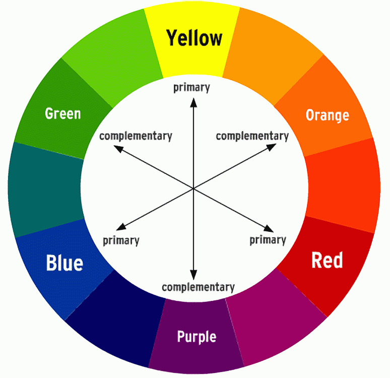

pair of colors opposite the color spectrum, examples: red & green, blue & orange, yellow & purple

will create the strongest contrast

---

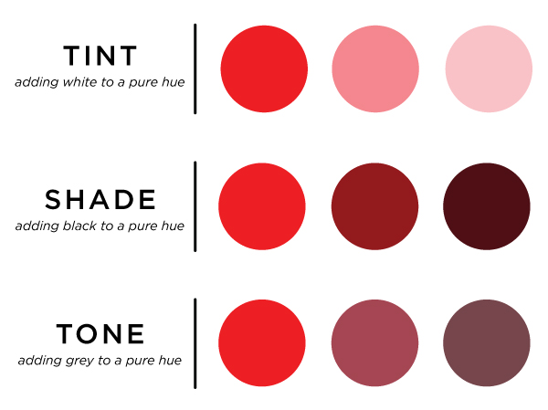

^ hue - color itself (red)
  tint - white
  shade - black
  tone - grey
  opinions on lots of pure white and black

---

## emotions

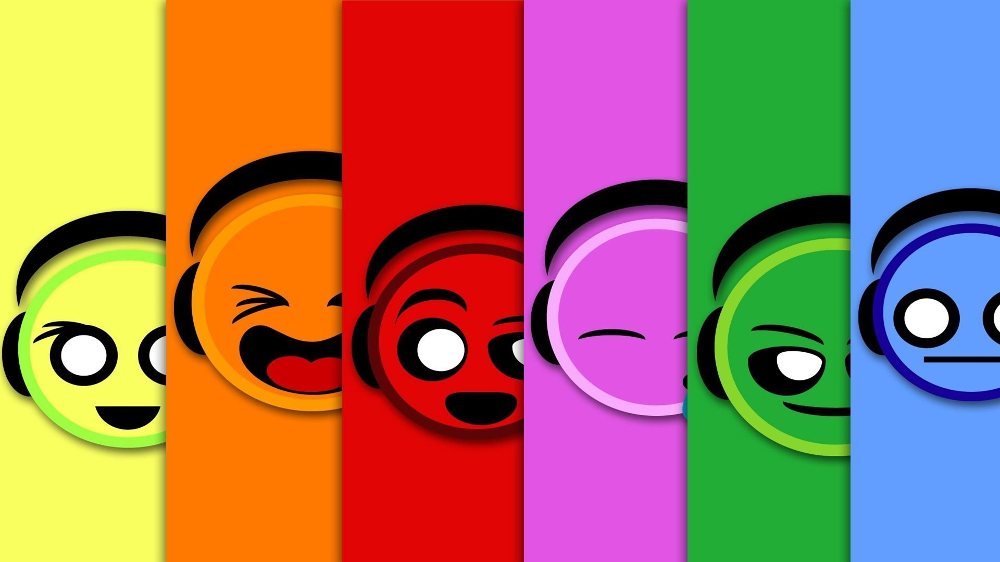

### [and choosing a color scheme](http://webdesign.tutsplus.com/articles/understanding-the-qualities-and-characteristics-of-color--webdesign-13292)

---

### tools

---

### [Kuler](https://color.adobe.com/create/color-wheel/?base=2&rule=Analogous&selected=2&name=My%20Color%20Theme&mode=rgb&rgbvalues=1,0.4406344737305593,0.22409706697158682,0.91,0.29800858602421687,0.203928330944144,1,0.27409706697158687,0.30542796975927244,0.91,0.203928330944144,0.5874391254397273,0.9817332907288064,0.22409706697158682,1&swatchOrder=0,1,2,3,4)

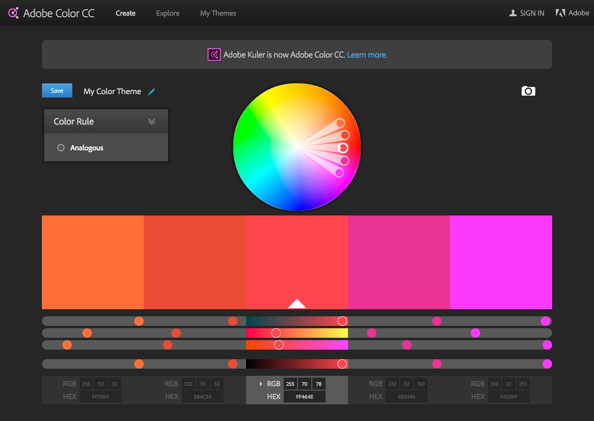 

---

### [Paletton](http://paletton.com/#uid=32Z0+0kKYKYn1LUtBL7LesuMhm6) 

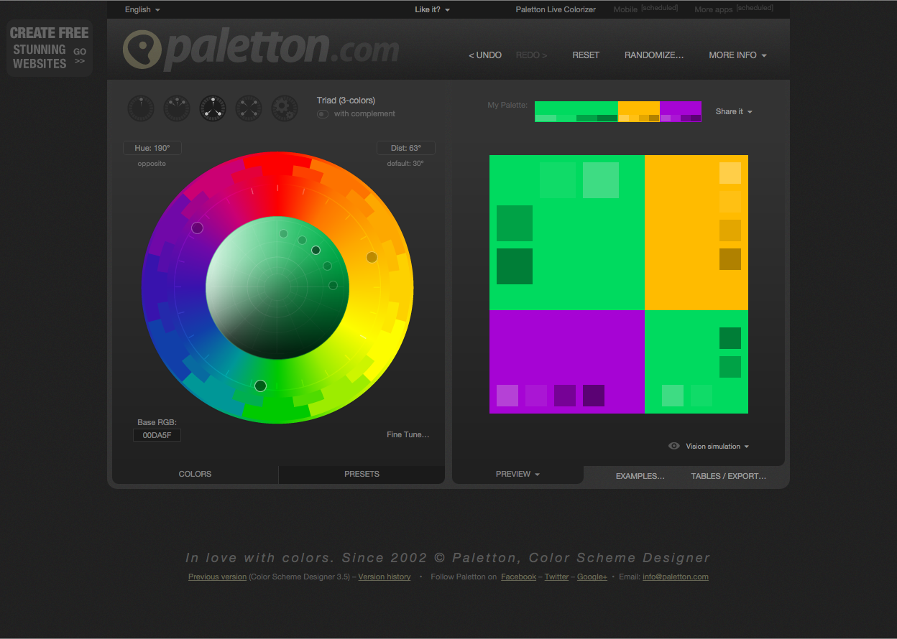 

---

## TYPE

---

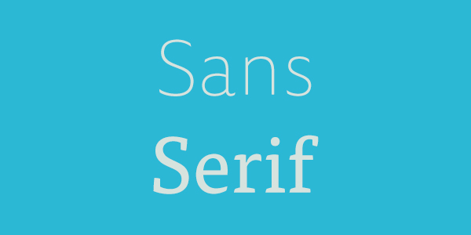

---

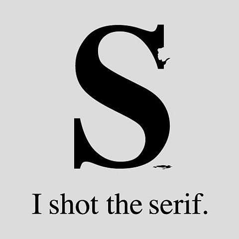

---

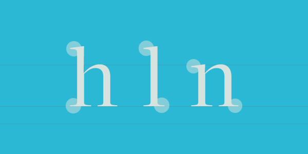

serif fonts have the little feet (embellishments)
more classic
easier to read in print

---

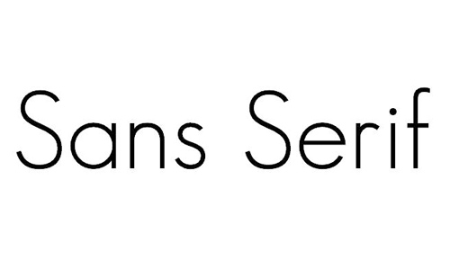

sans-serif fonts don't have the feet
more modern
easier to read on web

---

### so which one do I use? 

---

## one size does not fit all

### but there are some rules of thumb

---

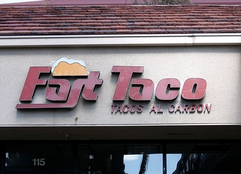

1. don't use more than 3 fonts on a single page
2. don't switch fonts mid-sentence without a very good reason
3. use sans serif fonts for online body text and serif fonts for headlines and print
4. Use monospace fonts for typewriter text and code blocks
5. Use script and fantasy fonts for accents

[more bad fonts](http://www.the42.ie/font-fails-1180586-Nov2013/?r_dir_d=1)

---

### choosing fonts

^ tone & intent
  create contrast by using 2 different fonts
  create even more contrast by pairing a serif font w/ a sans font

---
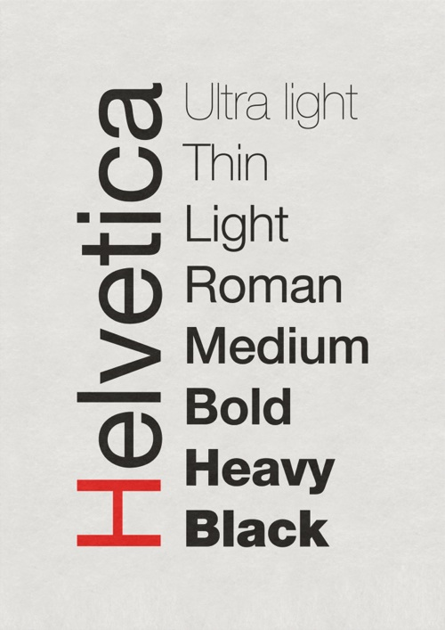

### font families

#### [pairings](http://viget.com/inspire/superfamily-font-roundup-40-plus-intentional-font-pairings)

^ one or more fonts that share common design features
ex: Helvetica

^ choosing a font family that has both sans & serif fonts gives flexibility and also ensures that the fonts will look good together because of their similar qualities

---

### resources

- [google fonts](http://www.google.com/fonts/)
- [typekit](https://typekit.com/fonts)
- [typecast](http://typecast.com/)

^ 	- http://www.google.com/fonts/
	- free, easy to use, shows impact on page load time
	- https://typekit.com/fonts
	- free but limited 
	- http://typecast.com/
	- free, see how the fonts you've chosen will play together on the screen, generates HTML/CSS

---


### size
-
### [contrast](http://leaverou.github.io/contrast-ratio/#%23E524DF-on-white) 
-
### and space

^ older audience? larger font?
contrast - make sure it's readable
space - allow room to breathe

---

### modular scale

^ helps increase readability and legibility
- helps balance white-space
- doesn't guarantee good design
	- tool to help set type and give design a head start

---

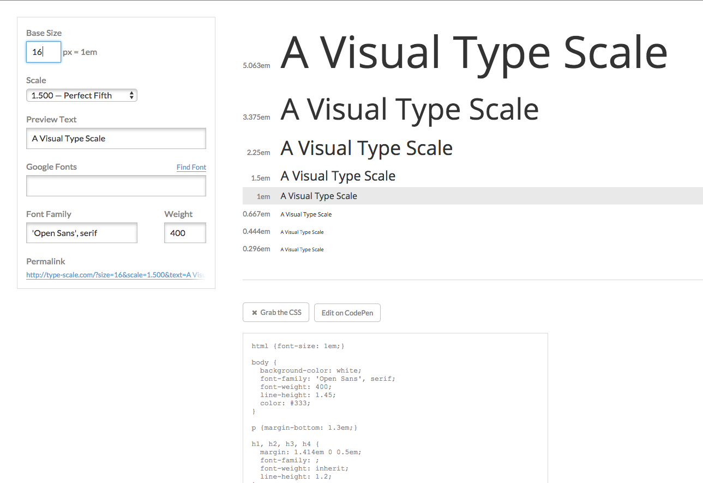

### common ratios

	2:3 (perfect fifth)
	3:4 (perfect fourth)
	1:1.618 (golden section)
	3:5 (major sixth)

-
-
-
[type-scale](http://type-scale.com/?size=16&scale=1.500&text=A%20Visual%20Type%20Scale&webfont=&font-family=%27Open%20Sans%27%2C%20serif&font-weight=400&font-family-headers=&font-weight-headers=inherit&background-color=white&font-color=%23333)

--- 

### trust your eyes

^ optical measurements are more visually accurate than mathematical ones
- if something is off, change it

---

### responsive type

^ create responsive breakpoints and change the sizes of your fonts as screens get smaller

---

## 1. Plan
at least a little bit 

## 2. Iterate
a lot

^ after you've done some planning and you've started to build, remember to iterate
don't get too tied to an idea or feature
if it isn't working, change it
MVP concept - what minimum features need to be finished for it to be 'complete'?

---

### frameworks

^ twitter bootstrap and zurb foundation
	use from the beginning!
	invest time into customizing!

---

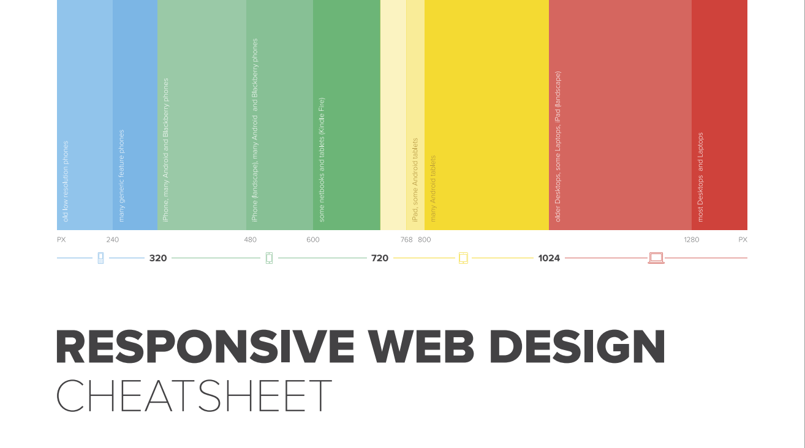

[cheat sheet](https://uxpin.s3.amazonaws.com/responsive_web_design_cheatsheet.pdf)

^ important to make sure that everything looks good on smaller screens
- chrome responsive emulator

---

``` css
@media screen and (max-width: 1280px) {

	.desktop-to-tablet-class {
		width: 75%;
	}
}

@media screen and (max-width: 768px) {

	.tablet-to-mobile-class {
		width: 85%;
	}
}

@media screen and (max-width: 320px) {

	.mobile-and-below-class {
		width: 100%;
	}
}
```


^ remember to include your responsive stylesheet AFTER your base stylesheet or you're gonna have a bad time

---

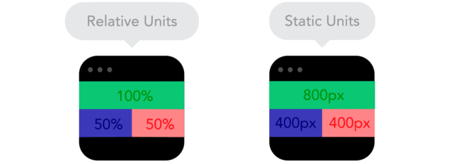

### use relative units

---

### questions?

---


- [design school for developers](http://webdesign.tutsplus.com/series/design-school-for-developers--webdesign-13793)
- [balsamiq wireframes](https://balsamiq.com/)
- [charachteristics of color and color schemes](http://webdesign.tutsplus.com/articles/understanding-the-qualities-and-characteristics-of-color--webdesign-13292)
- [kuler](https://color.adobe.com/create/color-wheel/)
- [paletton](http://paletton.com/#uid=32Z0+0kKYKYn1LUtBL7LesuMhm6)
- [google fonts](http://www.google.com/fonts/)
- [typekit](https://typekit.com/fonts)
- [typecast](http://typecast.com/)

- [font-family pairings](http://viget.com/inspire/superfamily-font-roundup-40-plus-intentional-font-pairings)
- [test type contrast](http://leaverou.github.io/contrast-ratio/#%23E524DF-on-white)
- [modular type-scale](http://type-scale.com/?size=16&scale=1.500&text=A%20Visual%20Type%20Scale&webfont=&font-family=%27Open%20Sans%27%2C%20serif&font-weight=400&font-family-headers=&font-weight-headers=inherit&background-color=white&font-color=%23333)
- [twitter bootstrap](http://getbootstrap.com/2.3.2/)
- [zurb foundation](http://foundation.zurb.com/) 
- [responsive design gifs](http://www.fastcodesign.com/3038367/9-gifs-that-explain-responsive-design-brilliantly)
- [responsive cheat sheet](https://uxpin.s3.amazonaws.com/responsive_web_design_cheatsheet.pdf)

---

## THANK YOU!